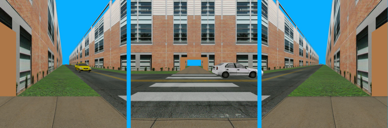

A Cross-Platform, Distributed Operating System for PC-Cluster-Based Virtual Reality
===================================================================================

Syzygy is a programming toolkit for writing virtual reality or other
graphical applications using OpenGL. It's been around for about 15 years and is
currently in use at [ISL](http://www.isl.uiuc.edu/), although we are
not adding new features at this point.

Its strong point is that the same application can run without modification
in standalone mode on a single PC or on a cluster of computers by modifying
one or more configuration files.

Its weak point is that the documentation is, well, incomplete and uneven,
but we're pretty good about answering questions.

Syzygy runs on Windows, Linux, MacOS X, and Irix. A
cluster can be heterogeneous, i.e. you can mix different operating
systems.

The Syzygy libraries themselves are written in C++. Syzygy applications
can be written in either C++ or Python.

For more information, see [the ISL software page](http://syzygy.isl.uiuc.edu/).

